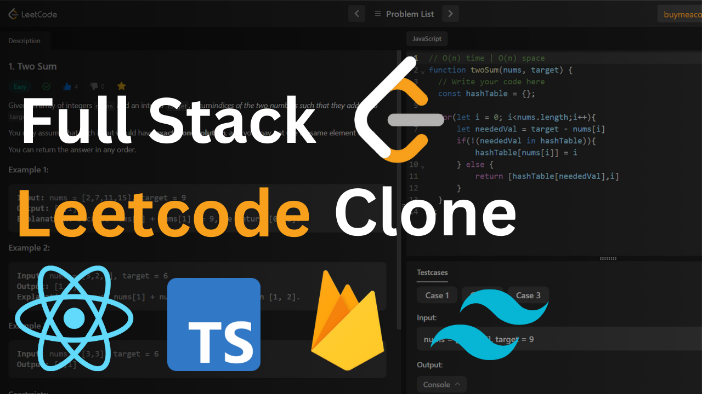

<!--
 * Template Name      : Leetscode
 * Template Version   : V 1.0.0
 * Template Url       : .....................
 * Language           : React (Next), SASS, Javascript, Tailwindcss
 * Contact Me : Skaype   :- Boudraa.Hammani
 *				      Facebook :- Ham mani
 *				      Email    :- Ham47mani@gmail.com
-->

<!-- PROJECT LOGO -->
 

  

  <h1 align="center">LeetsCode</h1>

  

    LeetsCode is a leetcode clone, i use in this web app nextjs, Firebase v9, Sass, tailwindcss.
    With many features like code editor for solving problem, like or dislike or starred problem, Send solution and check if it right solution ...
     
    <a href="https://hb-leetscode.vercel.app/">View Demo</a>
    ·
    <a href="https://github.com/Ham47Mani/leetscode/issues">Report Bug</a>
    ·
    <a href="https://github.com/Ham47Mani/leetscode/issues">Request Feature</a>
  

 
 

 
 
 

<!-- TABLE OF CONTENTS -->

  
Table of Contents

  <ol>
    <li>
      <a href="#about-the-project">About The Project</a>
      <ul>
        <li><a href="#built-with">Built With</a></li>
        <li><a href="#CSS & JS Library">CSS & JS library</a></li>
      </ul>
    </li>
    <li><a href="#contact">Contact</a></li>
  </ol>

<!-- ABOUT THE PROJECT -->
# About The Project

<b>LeetsCode</b> is a leetcode clone, i use in this web app nextjs, Firebase v9, Sass, tailwindcss.
    With many features like code editor for solving problem, like or dislike or starred problem, Send solution and check if it right solution ...

## Built With

I use i this template :

* TypeScript
* Nextjs v13...
* SASS (CSS)
* Firebase
* Recoiljs

## CSS & JS Library
* TailwindCss
* React-icon
* React-codemirror
* react-confetti
* react-firebase-hook
* react-split
* react-toastify
* react-youtube

<!-- CONTACT -->
## Contact

Hammani BOUDRAA - [@HAM47MANI](https://twitter.com/Ham7Mani) - Ham47mani@gmail.com
